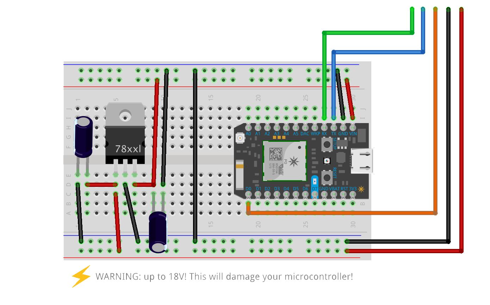
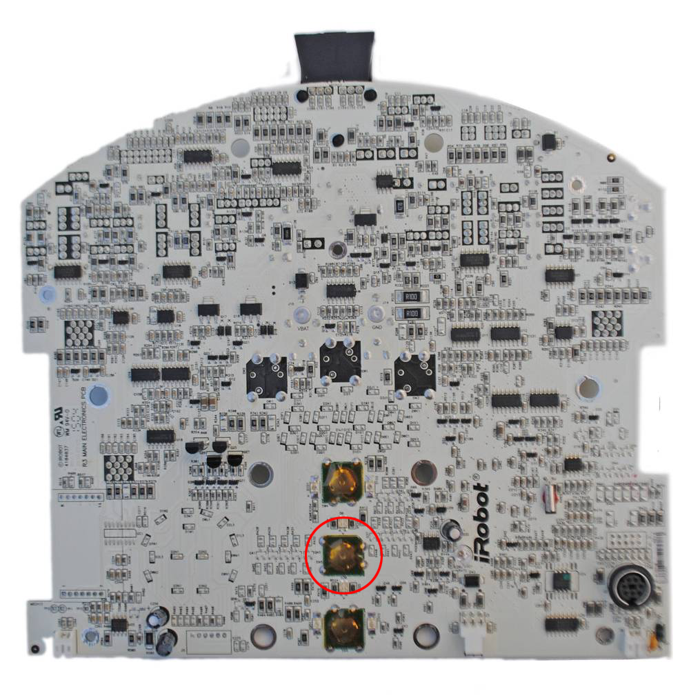

# Cloud Connected Roomba 5xx

Connect a Roomba 581 to the Cloud with a [Particle Photon](https://www.particle.io/products/hardware/photon-wifi-dev-kit).

## Donate

Making a donation is an act of generosity. Your support, however modest it might be, help to continue to support and improve this project!

Your queries will be given the highest priority, and you will be credited in the source code as a generous donor.

-  Paypal: [Donate](https://www.paypal.me/basecamptirol)
-  Flattr: [Donate](https://flattr.com/@basecamp.tirol)
-  Bitcoin: `1Kz88Erut22xptZP8vW6tm5ZH2pFWv9i4L`
-  Litecoin: `LNKP4XvL9mj33HHpFvLxEAWUckAV7FHs9s`
-  Ethereum: `0x9Bf203BE312c8FFD8967bD908C292e3b26B3b94f`

## Prerequisites

### Roomba

Obviously, a Roomba is required. I used a Roomba 581, which is part of the [Roomba 500 Series](http://www.irobot.com/For-the-Home/Support/Product-Resources/Roomba-500-Resources.aspx) but it should work with any Roomba with a SCI Mini-DIN 7 port that supports the Open Interface (OI).

The new [Roomba 900 Series](http://www.irobot.com/For-the-Home/Support/Product-Resources/Roomba-900-Resources.aspx) does no longer have an SCI Mini-DIN 7 port.

### Microcontrollers

This should work with any of the below mentioned Wi-Fi connected microcontollers although it has onlry been tested with the [Particle Photon](https://www.particle.io/products/hardware/photon-wifi-dev-kit) and with its -- now discontinued -- predecessor, the [Spark Core](https://docs.particle.io/datasheets/core-datasheet/).

#### [Particle Photon](https://www.particle.io/products/hardware/photon-wifi-dev-kit)

The [Particle Photon](https://www.particle.io/products/hardware/photon-wifi-dev-kit) as well as any variations like the P0 or P1) or its -- now discontinued -- predecessor, [Spark Core](https://docs.particle.io/datasheets/core-datasheet/) or other [Particle Cloud](https://www.particle.io/products/platform/particle-cloud)-connected devices like the [RedBear Duo](https://redbear.cc/duo/) are the recommended microcontrollers. The code here is written for them. Of course it also works with the [Particle Electron](https://www.particle.io/products/hardware/electron-cellular-dev-kit) in the unlikely case that you want 2G/3G connectivity for your Roomba.

Make sure that your microcontroller has the latest firmware. [Here is a guide](https://docs.particle.io/support/troubleshooting/firmware-upgrades/photon/) on how to update the firmware for the Particle Photon.

#### [Adafruit Feather M0 WiFi](https://www.adafruit.com/product/3010) or [Adafruit Feather HUZZAH](https://www.adafruit.com/product/2821)

Since the Feather M0 and the HUZZAH are Arduino compatible, the code should also work with only minor adaptions.

#### Raw ESP8266 Board

Same goes for a raw ESP8266 WiFi microcontroller board, although personally my experience with these is very limited. I always appreciate feedback or pull-requests!

## Hardware Build

### Roomba Mini-DIN 7

Most Roombas, up to the new [Roomba 900 Series](http://www.irobot.com/For-the-Home/Support/Product-Resources/Roomba-900-Resources.aspx) does no longer have an SCI Mini-DIN 7 port with serial `RX`/`TX` pins that can be used to communicate with Roomba over the [OI](#open-interface).

This connector provides two-way, serial communication at TTL (`0V` – `5V`) levels. The connector also provides an unregulated direct connection to Roomba’s battery, which you can use to power the OI applications. The Mini-DIN connector is located on the top of Roomba, beneath the snap-on decorative cover.

| Pin | Name   | Description                                        |
|-----|--------|----------------------------------------------------|
| `1` | `Vpwr` | Roomba battery `+` (unregulated `15.5V` – `18V`)   |
| `2` | `Vpwr` |                                                    |
| `3` | `RXD`  | `0V` – `5V` Serial Input to Roomba                 |
| `4` | `TXD`  | `0V` – `5V` Serial Output from Roomba              |
| `5` | `DD`   | Device Detect Input (active low) 1      |
| `6` | `GND`  | Roomba battery ground                              |
| `7` | `GND`  |                                                    |

1 The `DD` pin is used to wake Roomba from sleep. See [Caveats and Issues](#caveats-and-issues) if this does not work for your Roomba.

### Open Interface

iRobot® has provided a great specification document for the Open Interface: [iRobot® Roomba 500 Open Interface (OI) Specification](doc/iRobot_Roomba_500_Open_Interface_Spec.pdf)

It's a good starting point to understand the connections to the microcontroller and how to send commands to Roomba.

### Breadboard Setup

[Fritzing Source](src/breadboard.fzz)

## Caveats and Issues

### Roomba does not wake up from sleep

For Roomba models that have no wake up input on pin 5 of the external connector, you can connect the Particle Photon to the clean button input and control this from the microcontroller. The code needs to be changed for this to work.

Connect the Particle Photon's `D0` pin to the Roomba's *Clean* button through an 8K Ω resistor.

